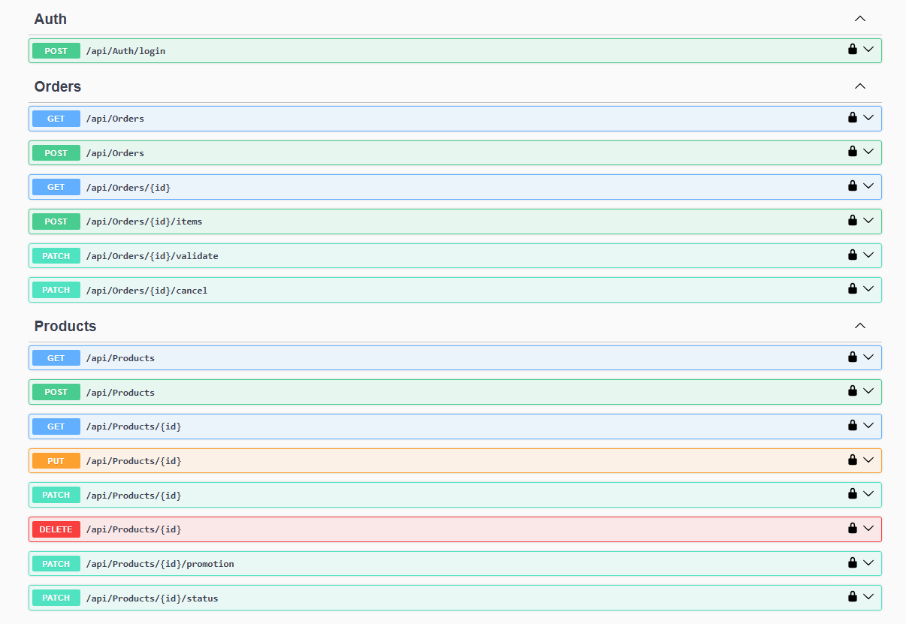

# 🚀 AdvancedDevSample - E-Commerce API

API REST .NET 9 construite selon les principes du **Domain-Driven Design (DDD)** et de la **Clean Architecture**.

[](https://dotnet.microsoft.com/)
[](#)

## 📋 Présentation
Ce projet académique est le backend d'un système e-commerce permettant la gestion d'un catalogue de produits et d'un cycle de vie de commandes (Panier ➔ Validation ➔ Annulation). 

Il démontre la maîtrise des concepts avancés d'ingénierie logicielle :
- ✅ **Clean Architecture** (Séparation stricte des responsabilités)
- ✅ **Domain-Driven Design (DDD)** (Aggregate Roots, Value Objects, Entities)
- ✅ **Sécurité** (Authentification JWT)
- ✅ **Qualité** (Gestion centralisée des erreurs via Middleware, Tests Unitaires)

## ⏱️ Démarrage Rapide (En 5 minutes)

### 1. Lancer l'application
Ouvrez un terminal à la racine du projet et exécutez :
```bash
cd AdvancedDevSample.Api
dotnet run
```

L'API sera disponible sur http://localhost:5000.

### 2. S'authentifier (JWT)
 - Allez sur l'interface Swagger : http://localhost:5000/swagger/



> _Liste des Endpoint developpé_

 - Utilisez l'endpoint POST /api/Auth/login avec ces identifiants :
```
{ "username": "admin", "password": "admin" }
```
 - Copiez le Token généré.

 - Cliquez sur le bouton "Authorize" 🔓 en haut de Swagger, tapez Bearer suivi d'un espace, puis collez votre token.

### 3. Tester le flux métier
 - Créer un produit : POST /api/Products
 - Créer un panier : POST /api/Orders
 - Ajouter le produit au panier : POST /api/Orders/{id}/items (Le prix et le stock seront automatiquement vérifiés).


# 📚 Structure de la Documentation
Pour explorer l'architecture en profondeur, consultez les fichiers dédiés :

- 📄 [DOCUMENTATION_TECHNIQUE.md](docs/DOCUMENTATION_TECHNIQUE.md) : Plongée dans le DDD, les couches et les modèles de données.
- 📄 [DIAGRAMMES.md](docs/DIAGRAMMES.md) : Représentations visuelles des flux et de l'architecture.
- 📄 [AUTHENTICATION.md](docs/AUTHENTICATION.md) : Guide de gestion des tokens JWT et de la sécurité.
