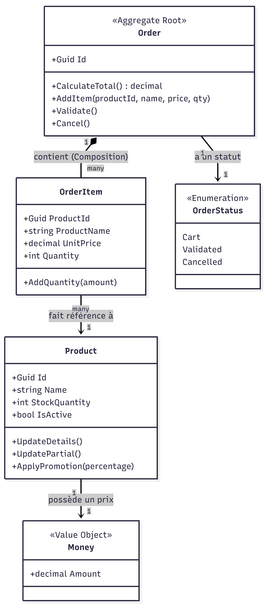
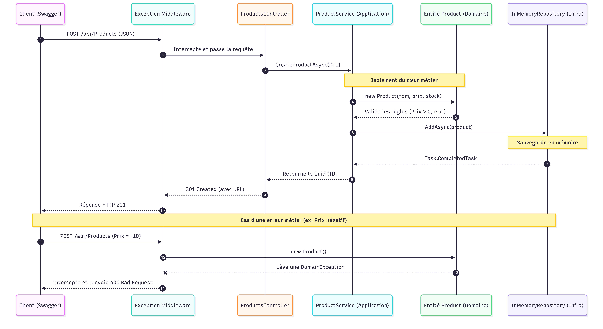
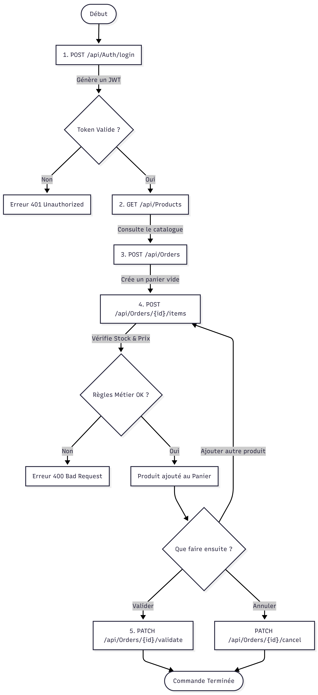

# DIAGRAMMES
*(Ce fichier regroupe toute la modélisation visuelle).*

## 📊 Diagrammes d'Architecture et de Flux

### 1. Modèle de Données (Domain-Driven Design)
Montre les relations entre nos Agrégats, Entités et Value Objects.

> _Modele de flux ou class_

## 2. Flux de fonctionnement technique (Clean Architecture)

Cycle de vie complet d'une requête HTTP, démontrant le respect des couches.

> _Diagrame de sequence_

## 3. Workflow Métier : Le parcours de la commande

Ce diagramme illustre les règles métier et les points de contrôle lors de l'ajout d'un produit au panier.

> _Diagrame de sequence_
