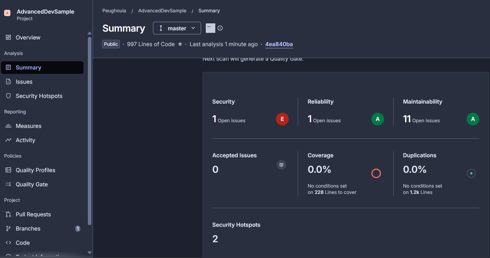
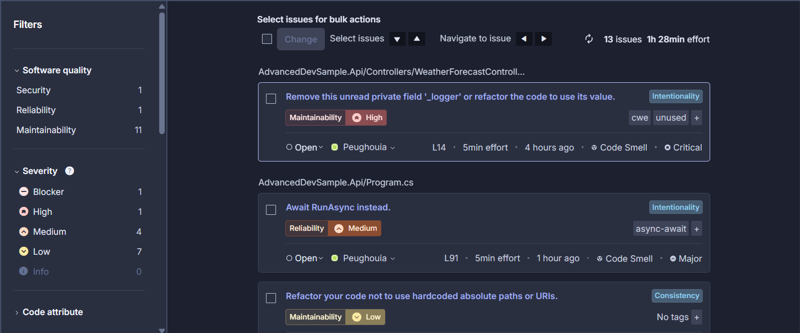
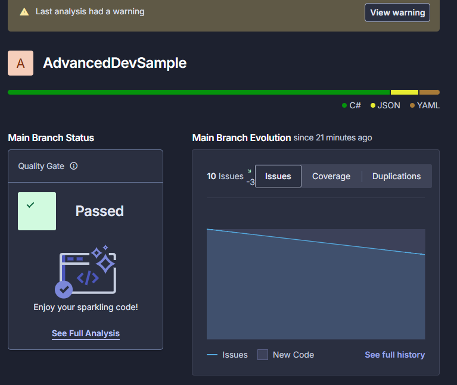
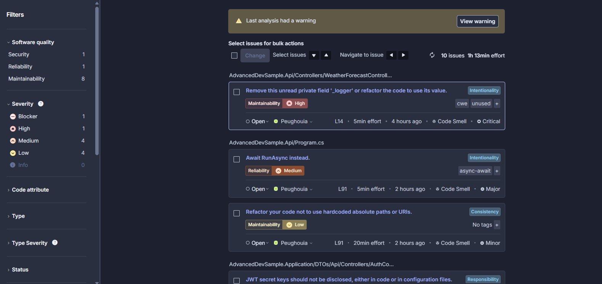

# 📊 Rapport d'Analyse Qualité (SonarQube)

## 🎯 Objectif
Dans le cadre de l'amélioration continue et pour garantir la robustesse de l'API **AdvancedDevSample**, le code source est analysé par SonarQube/SonarCloud. Cela permet de détecter proactivement les vulnérabilités de sécurité, les bugs potentiels et la dette technique (Code Smells).

---

## 📉 Phase 1 : État initial (Avant corrections)

Lors de la première analyse du code (997 lignes de code), SonarQube a détecté **13 anomalies (issues)** au total. 

**Répartition initiale :**
* **Sécurité :** 1 anomalie (Bloquant - Grade E)
* **Fiabilité :** 1 anomalie (Moyen - Grade A)
* **Maintenabilité :** 11 anomalies (Mineur/Moyen - Grade A)

### Aperçu du tableau de bord initial
*(Le score de sécurité était impacté, et la maintenabilité nécessitait un nettoyage de code).*

### Détail des anomalies initiales
Plusieurs "Code Smells" (dette technique) ont été mis en évidence, notamment :
* Des variables privées déclarées mais non utilisées (ex: `_logger` dans `WeatherForecastController`).
* Des appels asynchrones mal gérés (nécessitant `await RunAsync`).
* L'utilisation de chemins absolus codés en dur.

---

## 🛠️ Phase 2 : Résolutions et Refactoring

Suite à ce premier rapport, une phase de refactoring a été menée pour assainir la base de code et réduire la dette technique.

**Actions menées :**
1. **Nettoyage du code mort :** Suppression des champs privés non lus (ex: l'injection du `ILogger` non utilisé).
2. **Optimisation de la maintenabilité :** Correction de plusieurs "Code Smells" mineurs pour améliorer la lisibilité.
3. **Réduction de la dette technique :** Le nombre total d'anomalies est passé de **13 à 10** (réduction de 3 issues de maintenabilité).

---

## 📈 Phase 3 : Résultats après optimisation

Après le déploiement des correctifs, la nouvelle analyse montre une nette amélioration. L'indicateur le plus important, le **Quality Gate**, a été validé avec succès (**Passed**).

### Validation du Quality Gate
Le graphique d'évolution confirme la tendance à la baisse des problèmes (baisse de 3 issues) et valide la propreté globale du code nouvellement poussé.

### Nouvel état des anomalies (10 issues restantes)
La liste des anomalies a été réduite. Le travail restant se concentre désormais sur les éléments critiques de sécurité identifiés par SonarQube, afin de finaliser le nettoyage.

---

## 🚀 Prochaines Étapes
Pour viser l'excellence technique (Objectif Zéro Défaut) :
1. **Sécurité (Priorité Haute) :** Résoudre l'alerte concernant la clé secrète JWT (`JWT secret keys should not be disclosed`) en s'assurant qu'elle est bien gérée via les variables d'environnement ou les User Secrets.
2. **Couverture de Test :** Augmenter le pourcentage de couverture de code (actuellement à 0.0% sur Sonar) en liant les rapports d'exécution des tests `xUnit` à l'analyseur SonarQube.